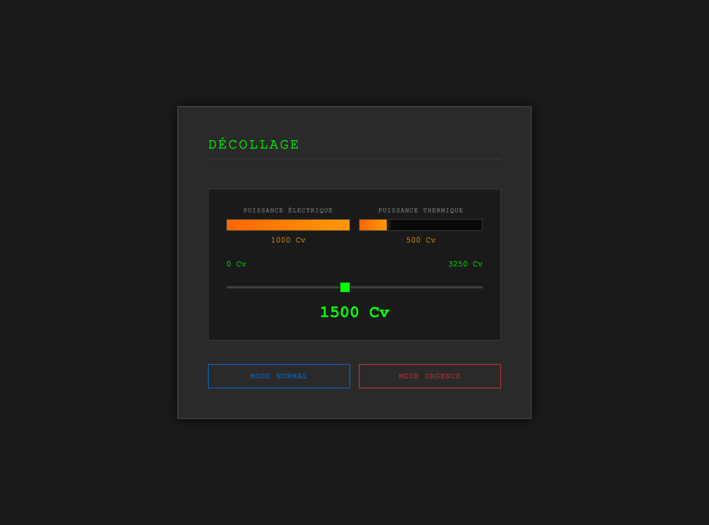
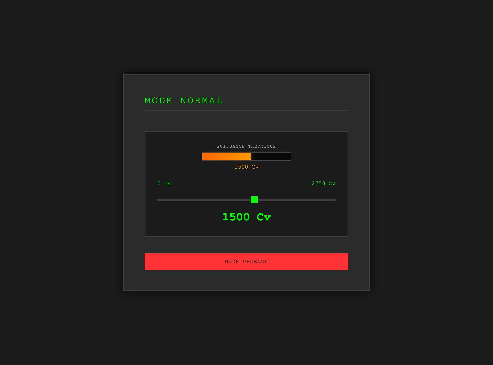
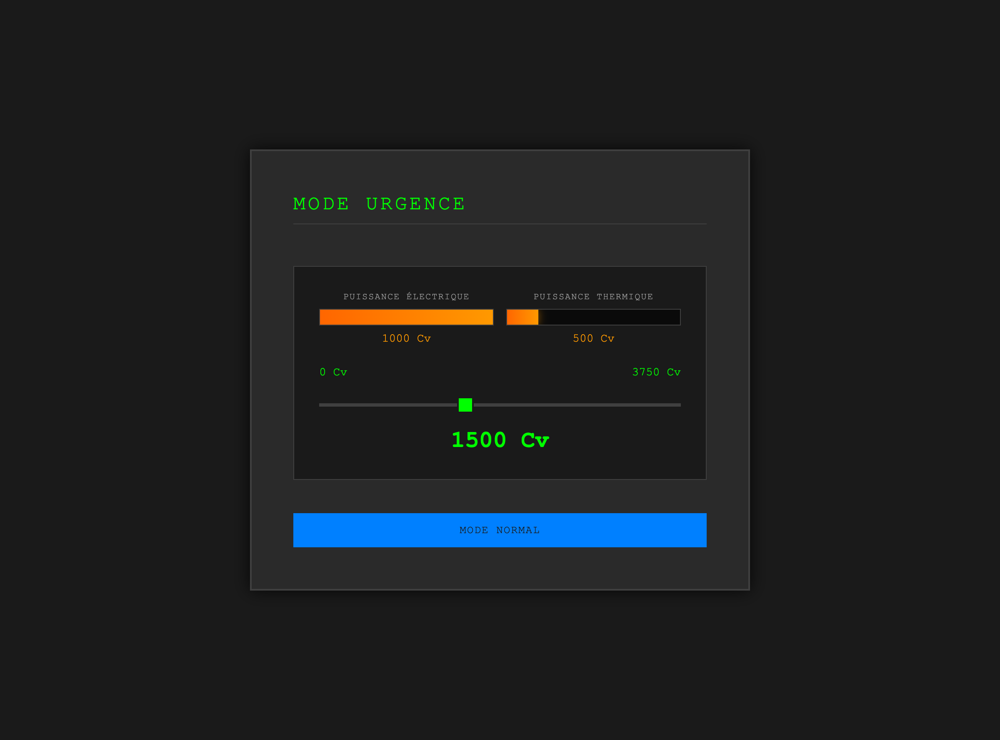

# Simulateur Propulsion Hybride - VOL-TE

Interface de simulation pour système de propulsion hybride électrique/thermique pour avion.

## 📋 Présentation

Ce simulateur permet de contrôler et visualiser la répartition de puissance entre deux sources d'énergie :
- **Puissance électrique** (moteur électrique)
- **Puissance thermique** (moteur thermique)

L'interface propose 3 modes de vol avec des caractéristiques différentes.

## 🎮 Modes de Vol

### Mode DÉCOLLAGE



**Caractéristiques :**
- Puissance totale : **0 - 3250 Cv**
- Logique de distribution :
  - De 0 à 1000 Cv : seule la puissance électrique est utilisée
  - Au-delà de 1000 Cv : l'électrique reste à 1000 Cv max, la thermique compense le reste

**Répartition :**
- Puissance électrique : 0 - 1000 Cv (plafonnée)
- Puissance thermique : 0 - 2250 Cv

---

### Mode NORMAL



**Caractéristiques :**
- Puissance totale : **0 - 2750 Cv**
- Logique de distribution :
  - Utilisation exclusive de la puissance thermique
  - Pas de puissance électrique dans ce mode

**Répartition :**
- Puissance thermique : 0 - 2750 Cv

---

### Mode URGENCE



**Caractéristiques :**
- Puissance totale : **0 - 3750 Cv**
- Logique de distribution :
  - De 0 à 1000 Cv : seule la puissance électrique est utilisée
  - Au-delà de 1000 Cv : l'électrique reste à 1000 Cv max, la thermique compense le reste

**Répartition :**
- Puissance électrique : 0 - 1000 Cv (plafonnée)
- Puissance thermique : 0 - 2750 Cv

## 🚀 Utilisation

1. Ouvrez `interface.html` dans votre navigateur
2. Utilisez le curseur principal pour ajuster la puissance totale
3. Les jauges circulaires affichent la répartition automatique électrique/thermique
4. Changez de mode avec les boutons en bas :
   - **MODE NORMAL** : vol de croisière standard
   - **MODE URGENCE** : puissance maximale disponible

## 💡 Fonctionnalités

- ✅ Visualisation en temps réel de la répartition de puissance
- ✅ Jauges circulaires style tableau de bord avec aiguilles
- ✅ Conservation des valeurs lors du changement de mode
- ✅ Limitation automatique si la valeur dépasse le max du nouveau mode
- ✅ Interface cockpit réaliste (fond sombre, affichage vert/orange)

## 🔧 Configuration

Les paramètres sont modifiables dans le fichier `interface.html` :

```javascript
const CONFIG = {
    decollage: {
        min: 0,
        max: 3250,
        initial: 50
    },
    normal: {
        min: 0,
        max: 2750,
        initial: 50
    },
    urgence: {
        min: 0,
        max: 3750,
        initial: 50
    }
};
```

## 📂 Structure

```
VOL-TE/
├── interface.html          # Interface web principale
├── python/
│   └── hybride.py         # Simulateur terminal (optionnel)
├── screenshots/           # Captures d'écran des modes
├── embedded/              # ⭐ NOUVEAU: Système embarqué STM32
│   ├── PowerManagement/   # Sketch Arduino (1370 lignes)
│   │   ├── PowerManagement.ino
│   │   ├── config.h
│   │   ├── PowerDistribution.h/cpp
│   │   ├── FlightMode.h/cpp
│   │   └── ARINCSimulator.h/cpp
│   ├── README.md          # Guide installation & utilisation
│   ├── TECHNICAL_DOC.md   # Documentation technique complète
│   ├── QUICK_START.md     # Aide-mémoire rapide
│   └── verify_project.sh  # Script de vérification
└── README.md             # Ce fichier
```

## 🚀 Système Embarqué STM32

### Version Microcontrôleur

Le système a été porté sur **STM32** pour une utilisation en conditions réelles. Cette version embarquée réplique **exactement** la logique de distribution de l'interface web.

**Caractéristiques :**
- ✅ Microcontrôleur : STM32F103 (Blue Pill) ou équivalent
- ✅ IDE : Arduino IDE avec support STM32
- ✅ Interface : Serial Terminal (115200 baud)
- ✅ Protocole : ARINC 429 simulé
- ✅ Style : DO-178C + MISRA C++ (aviation-grade)
- ✅ Code : 1370 lignes (312 .ino + 488 .h + 570 .cpp)

**Commandes Série :**
```
d - Mode DÉCOLLAGE
n - Mode NORMAL  
u - Mode URGENCE
+ - Augmenter puissance (+10 Cv)
- - Diminuer puissance (-10 Cv)
1500 - Définir puissance exacte (ex: 1500 Cv)
s - Status complet avec dashboard ASCII
h - Aide
r - Reset système
```

**Exemple de Dashboard :**
```
╔════════════════════════════════════════════════════════════════╗
║  MODE: DECOLLAGE                                               ║
╠════════════════════════════════════════════════════════════════╣
║  TOTAL  [███████████████░░░░░░░░░░░░░░░░░░░░░░░] 1500 Cv ║
║  ELEC   [████████████████████████████████████████] 1000 Cv  ║
║  THRM   [████████░░░░░░░░░░░░░░░░░░░░░░░░░░░░░░░] 500 Cv  ║
╚════════════════════════════════════════════════════════════════╝
```

**📚 Documentation Embarqué :**
- [Installation & Guide Utilisateur](embedded/README.md)
- [Documentation Technique & Architecture](embedded/TECHNICAL_DOC.md)
- [Quick Start & Aide-Mémoire](embedded/QUICK_START.md)

## 🎯 Données Techniques

**Conversion de puissance :**
- 100% = 2200 W (constante de référence)
- Turbine constante : 80% = 1760 W

**Distribution par Mode :**

| Mode | Electric Max | Thermal Max | Total Max |
|------|--------------|-------------|-----------|
| DÉCOLLAGE | 1000 Cv | 2250 Cv | 3250 Cv |
| NORMAL | 0 Cv | 2750 Cv | 2750 Cv |
| URGENCE | 1000 Cv | 2750 Cv | 3750 Cv |

**Phases de vol** (système Python - `hybride.py`) :
1. TAKEOFF (Décollage)
2. CLIMB (Montée)
3. CRUISE (Croisière)
4. DESCENT (Descente)
5. LANDING (Atterrissage)

---

**Hackathon FlyImpulse - Safran PW100 - Février 2026**
